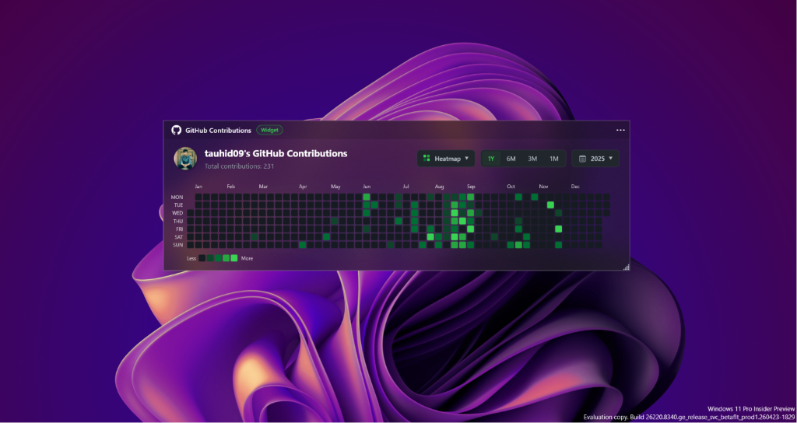
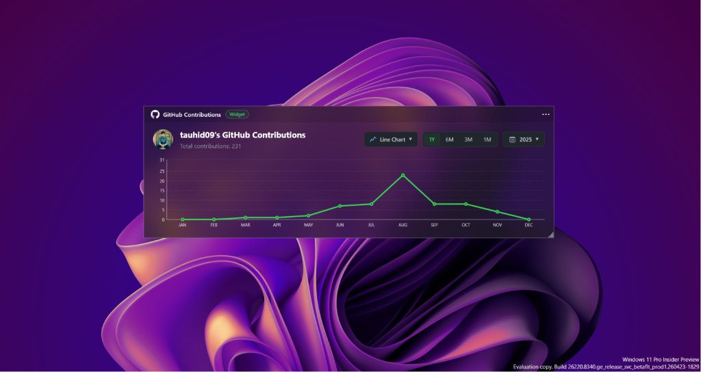
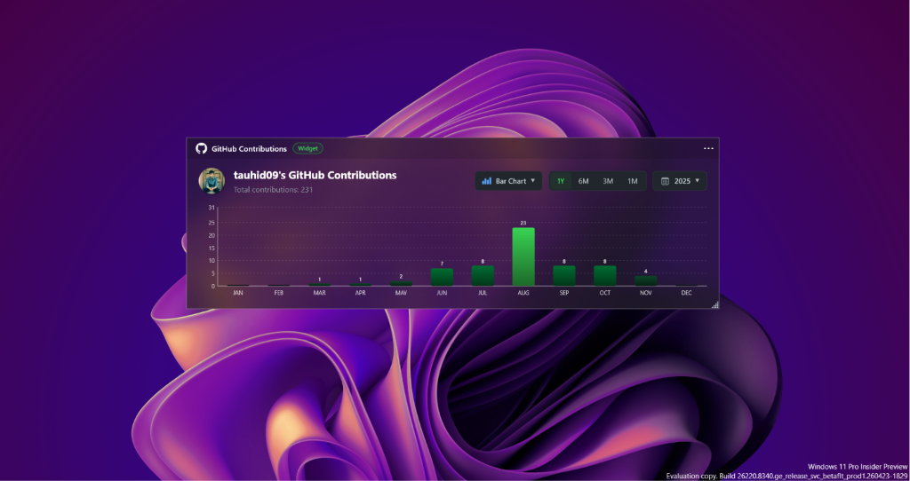
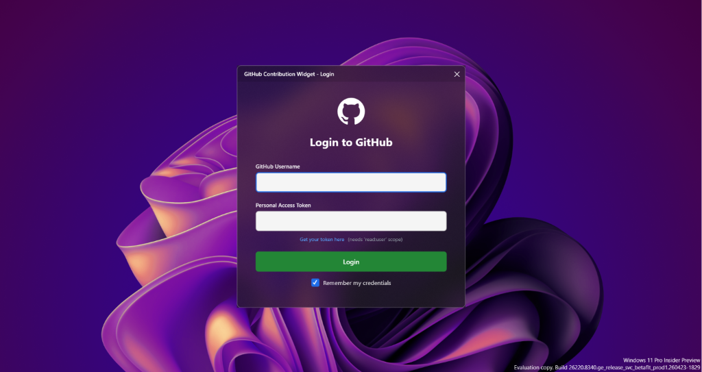
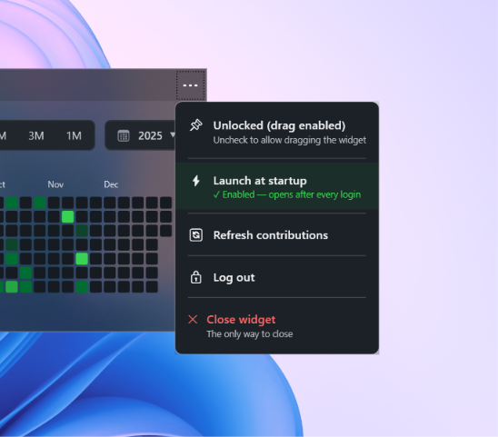

<p align="center">
  
</p>

<h1 align="center">📈 GitHub Contribution Desktop Widget</h1>

<p align="center">
  A beautiful, modern desktop widget that displays your GitHub contribution graph directly on your Windows desktop — with live data, stunning animations, and a frosted glass-morphism design.
</p>

<p align="center">
  
  
  
  
</p>

---

## ✨ Preview

### 🔥 Heatmap View (Default)
The classic GitHub contribution calendar rendered directly on your desktop with dynamic scaling.



### 📈 Line Chart View
Visualize your coding momentum and growth trends month-by-month.



### 📊 Bar Chart View
See your monthly contribution activity as clean, animated bar charts.



---

## 🚀 Getting Started

### Prerequisites
- **Windows 10** or **Windows 11**
- **.NET Framework 4.8.1**
- **Visual Studio** (for building from source)

---

## 🔑 How to Get Your GitHub Personal Access Token

The widget needs a GitHub **Personal Access Token (PAT)** to fetch your contribution data. Here's how to create one:

### Step 1: Open GitHub Developer Settings
1. Log into [github.com](https://github.com) and go to your profile.
2. Click on **Settings** (bottom of the profile dropdown).
3. Scroll down the left sidebar and click **Developer settings** (the very last item).

### Step 2: Generate a New Token
1. Go to **Personal access tokens** → **Tokens (classic)**.
2. Click **Generate new token** → **Generate new token (classic)**.
3. Give it a descriptive name like `Desktop Contribution Widget`.

### Step 3: Select Scopes (Permissions)

> **⚠️ IMPORTANT: You MUST select the correct scopes or the widget won't work!**

| Scope | Required? | Why? |
|---|---|---|
| `read:user` | ✅ **Required** | Fetches your avatar, profile info, and public contribution data |
| `repo` | 🟡 **Highly Recommended** | Includes contributions from your **private repositories** in the count |

Without the `repo` scope, your private repository commits, PRs, and issues will **not** appear in the widget — your contribution count will be lower than what you see on your GitHub profile.

### Step 4: Copy Your Token
- Click **Generate token** at the bottom.
- **Copy the token immediately!** GitHub will only show it once.

> **💡 Tip:** Store the token somewhere safe (e.g., a password manager). If you lose it, you'll need to generate a new one.

---

## 🔐 Login Process

On the **first launch**, the widget will display a login window:



### How to Login:
1. Enter your **GitHub Username** (e.g., `tauhid09`).
2. Paste your **Personal Access Token** into the token field.
3. Click **Login**.

### What Happens After Login:
- ✅ Your credentials are **encrypted using Windows DPAPI** and saved locally.
- ✅ The widget **registers itself to launch on Windows startup** automatically.
- ✅ **You will never need to login again** — even after restarting your PC.

> **🔒 Security Note:** Your token is encrypted with hardware-bound Windows Data Protection API (DPAPI). It is stored at:
> ```
> C:\Users\<YourName>\AppData\Local\GitHubContributionWidget\github_credentials.dat
> ```
> This file is encrypted with your Windows user account key and cannot be read by other users or apps.

---

## 🎨 Features & Views

The widget supports **4 interactive chart views**, switchable from the View dropdown in the header:

### 🟩 Heatmap (Default View)
- The classic GitHub contribution calendar grid.
- Dynamic scaling — expands to fill the widget at any size.
- Color-coded intensity from **Less** (gray) → **More** (bright green).
- Shows month labels (Jan–Dec) and day labels (Mon–Sun).

### 📈 Line Chart
- Monthly aggregation rendered as a smooth trend line.
- Shows your coding momentum over the selected timeframe.
- Animated dots at each data point with hover tooltips.

### 📊 Bar Chart
- Monthly contribution count displayed as vertical bars.
- Active day counts labeled above each bar.
- Gradient-filled bars with smooth entrance animations.

### 🥧 Pie Chart
- Proportional breakdown of your contributions:
  - **Commits** · **Pull Requests** · **Issues** · **Code Reviews**
- Animated pie slices with color-coded legends.

---

## ⏱️ Timeframe Filters

Use the segment control in the header to filter your data:

| Button | Time Range |
|---|---|
| **1Y** | Full Year (default) |
| **6M** | Last 6 Months |
| **3M** | Last 3 Months |
| **1M** | Last Month |

All chart views dynamically re-render when you switch timeframes.

---

## 📅 Year Selector

The year dropdown dynamically queries GitHub to find every year you've been active. Click the year button (e.g., `2025 ▼`) to browse your full contribution history.

---

## ⚙️ Options Menu

Click the **three-dot menu** (⋯) in the top-right corner to access widget settings:



| Option | Description |
|---|---|
| **Unlocked (drag enabled)** | Toggle to lock/unlock the widget position. When locked, the widget cannot be accidentally moved. |
| **Launch at startup** | When enabled (green checkmark), the widget auto-launches every time you log into Windows. |
| **Refresh contributions** | Manually re-fetches the latest data from GitHub. |
| **Log out** | Deletes saved credentials and restarts the app. You'll need to login again. |
| **Close widget** | The **only way** to close the widget. It ignores the Windows "Show Desktop" gesture to stay visible. |

---

## 🏗️ Installation

### Option 1: Build from Source
```bash
git clone https://github.com/tauhid09/GitHubContributionWidget.git
cd GitHubContributionWidget
```
1. Open `GitHubContributionWidget.csproj` in **Visual Studio**.
2. Build → Run (F5).
3. Login with your credentials on the first launch.

### Option 2: Download Release
Download the latest `.exe` from the [Releases](https://github.com/tauhid09/GitHubContributionWidget/releases) page and run it directly.

---

## 🛠️ Tech Stack

| Technology | Purpose |
|---|---|
| **C# / WPF** | Desktop UI framework with custom canvas rendering |
| **GitHub GraphQL API** | Single-query, high-performance contribution data fetching |
| **Windows DPAPI** | Hardware-bound encryption for secure credential storage |
| **Windows Registry** | Startup registration and window position persistence |
| **Newtonsoft.Json** | JSON parsing for GitHub API responses |

---

## 🤝 Contributing

Contributions, issues, and feature requests are welcome! Feel free to open an issue or submit a pull request.

---

## 📜 License

This project is open source and available under the [MIT License](LICENSE).

---

<p align="center">
  Made with ❤️ by <a href="https://github.com/tauhid09">tauhid09</a>
</p>